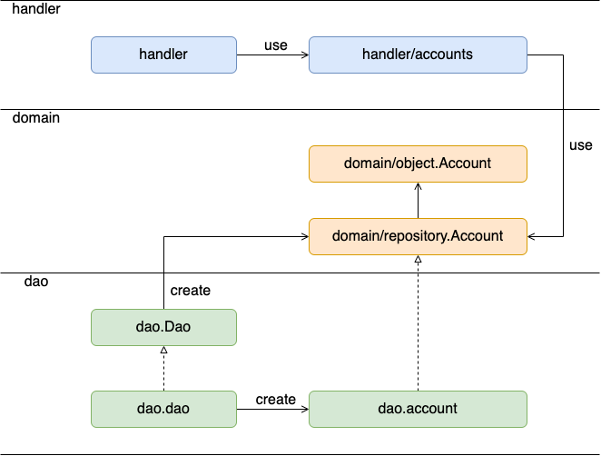

# mission-dmm-bootcamp-go
TechBowl社MISSION用テンプレートリポジトリ(新卒研修-Go)

## Table of Contents
* [Mission](#mission)
* [Vocabulary](#vocabulary)
* [Development Environment](#development-environment)
    * [Requirements](#requirements)
	* [Start](#start)
	* [Shutdown](#shutdown)
	* [Log](#log)
	* [Hot Reload](#hot-reload)
	* [Swagger UI](#swagger-ui)
	* [DB](#db)
* [Code](#code)
    * [Architecture](#architecture)
    * [Module Dependency](#module-dependency)
    * [Library](#library)
    * [Utilities](#utilities)

## Mission
このMISSIONではDMMのGo新卒研修の演習課題を体験していただきます。

演習課題ではTwitter・Mastodonライクな仮想のサービス、Yatterを実装していきます。

みなさんにはこのMISSIONでYatterのバックエンドAPIを実装していただきます。

## Vocabulary
* status：SNSへの投稿
    * follow：他のアカウントのステータスを購読すること
    * following：あるアカウントがfollowしているアカウント
    * follower：あるアカウントをfollowしているアカウント
* timeline：時系列順に並んだstatusの集まり
    * public timeline：全アカウントのstatusが集まるtimeline
    * home timeline：followしているアカウントのstatusが集まるtimeline


## Development Environment
開発環境をdocker-composeで構築しています。

### Requirements
* Go
* docker / docker-compose

### Start
```
docker-compose up -d
```

### Shutdown
```
docker-compose down
```

### Log
```
# ログの確認
docker-compose logs

# ストリーミング
docker-compose logs -f

# webサーバonly
docker-compose logs web
docker-compose logs -f web
```

### Hot Reload
[air](https://github.com/cosmtrek/air)によるホットリロードをサポートしており、コードを編集・保存すると自動で反映されます。
読み込まれない場合は`docker-compose restart`を実行してください。

### Swagger UI
API仕様をSwagger UIで確認できます。

開発環境を立ち上げ、Webブラウザで[localhost:8081](http://localhost:8081)にアクセスしてください。

#### Test
各API定義の"Try it out"からAPIの動作確認を行うことができます。

#### Authentication
鍵マークのついたエンドポイントは認証付きエンドポイントです。

`Authentication`というHTTPヘッダに`username ${ユーザー名}`を指定する単純な仕様です。

動作確認の際には画面上部の"Authorize"からヘッダの値の設定を行ってください。

### DB
マイグレーションツールの用意はありません。

初回起動時に`ddl/`以下にあるSQLファイルが実行されます。
再読み込みの際は`.data/mysql/`を削除し、DBを初期化してください。
```
docker-compose down  # 開発環境が稼働中なら止める
rm -rfd .data/mysql  # `.data/mysql/`以下を削除
docker-compose up -d # 再起動
```

## Code
### Architecture
```
.
├── app      ----> application core codes
│   ├── app      ----> collection of dependency injected
│   ├── config   ----> config
│   ├── domain   ----> domain layer, core business logics
│   ├── handler  ----> (interface layer & application layer), request handlers
│   └── dao      ----> (infrastructure layer), implementation of domain/repository
│
└── ddl      ----> DB definition master
```

#### app
モジュールの依存関係を整理するパッケージで、DIコンテナを扱います。
今回は簡素なものになっていて、DAOの組み立てとhandlerのDAO（が提供するdomain/repository）への依存の管理のみ行っています。

#### config
サーバーの設定をまとめたパッケージです。DBやlistenするポートなどの設定を取得するAPIがまとめてあります。

#### domain
アプリケーションのモデルを扱うdomain層のパッケージです。

##### domain/object
ドメインに登場するデータ・モノの表現やその振る舞いを記述するパッケージです。
今回は簡単のためDTOの役割も兼ねています。

##### domain/repository
domain/objectで扱うEntityの永続化に関する処理を抽象化し、インターフェースとして定義するパッケージです。
具体的な実装はdaoパッケージで行います。

#### handler
HTTPリクエストのハンドラを実装するパッケージです。
リクエストからパラメータを読み取り、エンドポイントに応じた処理を行ってレスポンスを返します。
機能の提供のために必要になる各種処理の実装は別のパッケージに切り分け、handlerは入出力に注力するケースも多いですが、今回は簡単のため統合しています。

#### dao
domain/repositoryに対する実装を提供するパッケージです。
DBなど外部モジュールへアクセスし、データの保存・取得・更新などの処理を実装します。

### Module Dependency


### Library
* HTTP
    * chi（[ドキュメント](https://pkg.go.dev/github.com/go-chi/chi)）
* DB
    * sqlx（[ドキュメント](https://pkg.go.dev/github.com/jmoiron/sqlx)）

### Utilities
このテンプレートでは実装をサポートするユーティリティ関数を提供しています。

#### app/handler/request
リクエストの扱いに関するユーティリティをまとめています。
テンプレートにはパスパラメータ`id`の読み取りを補助する関数`IDOf`を用意しています。
```
// var r *http.Mux
r.Get("/{id}", func(w http.ResponseWriter, r *http.Request){
  id, err := request.IDOf(r)
  ...
})
```

#### app/handler/httperror
エラーレスポンスを返すためのユーティリティをまとめています。
```
func SomeHandler(w http.ResponseWriter, r *http.Request) {
  ...
  if err != nil {
    httperror.InternalServerError(w, err)
	return
  }
  ...
}
```

#### app/handler/auth
認証付きエンドポイントの実装のためのミドルウェア関数を提供しています。
`chi.Mux#Use`や`chi.Mux#With`を用いて利用できます。
- [chiドキュメント](https://pkg.go.dev/github.com/go-chi/chi@v1.5.4)

ミドルウェアを埋め込んだエンドポイントでは`*http.Request`から`AccountOf`でリクエストと紐づくアカウントを取得できます。
```
// var r *http.Request
account := auth.AccountOf(r)
```
